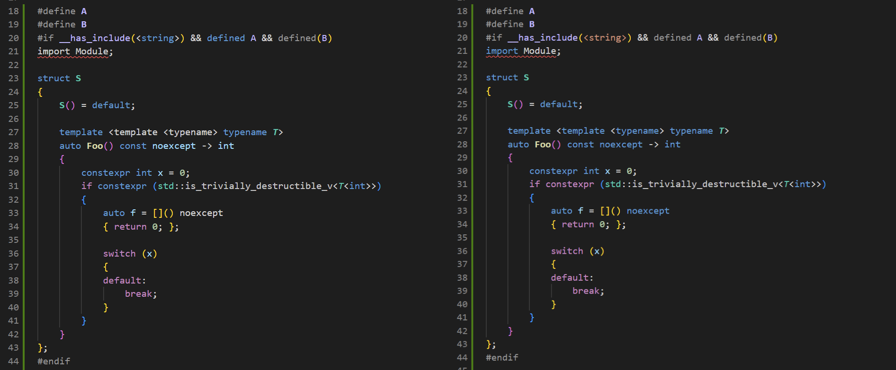
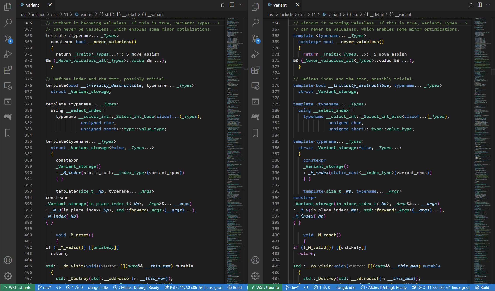

# Least C++ Syntax

Because of the complexity of the C++ language, it is hard for a syntax highlighter to function correctly and accurately with regex matching. In most cases, however, a language server would be hooked up to parse the source code and recolor the majority of tokens with sementic highlighting, discarding whatever a syntax highlighter offers. As the language server has more knowledge of the intrinsic structure of the source code, it could color the source code far more accurately. On this basis, this extension intends to provide only a basic set of syntax highlighting that complements a sementic highlighing provider, achieving:

1. Simplicity. Only to colorize a fraction of the C++ language has to offer.
2. Performance. Of course, it's simple!
3. Robustness. Less corner cases that could break the syntax rules.
4. Agility. Syntax rules can catch up the latest C++ standard.

## Features

Provides basic syntax highlighting for:

- Comments
- Keywords
- Number literals
- String literals
- Preprocessor directives

### What this extension **CAN** do:
To be used as a lightweight complement of a language-server-based semantic highligher like clangd-vscode.

### What this extension **CANNOT** do:
Provides what the best that a syntax highlighter could offer and replace other state-of-the-art C++ syntax highlighters.

Some bizarre but valid constructs such as keywords splitted by a backslash in two lines are not being colored correctly. Some ill-formed programs may be colored incorrectly as well.

## Showcase

The following examples show how this extension(right) is more robust compared to Better C++ Syntax(left), while retaining most highlightings with the help of clangd:

*Captured in Better C++ Syntax v1.15.13 and Minimal C++ Syntax v0.0.3. Behaviors of both extensions may change in future versions.*

## Requirements

Please use this extension to complement a semantic highlighter such as clangd. Standalone uses should provide a poor highlighting experience.

## Extension Settings

None

## Known Issues

- Support for toolchain-dependent pragmas and extensions are poor.
- User-defined suffix for string literals are not supported yet.
- No option to choose the C++ standard to highlight.

## Credits

Syntax rules in this extension are heavily influenced by [better-cpp-syntax](https://github.com/jeff-hykin/better-cpp-syntax).

Also, thanks for the community maintaining the awesome [cppreference](https://en.cppreference.com/w/)!